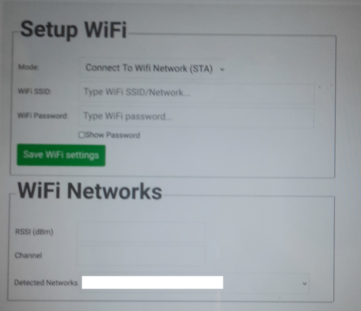

# Raspberry Pi Pico W Project Template.
This project is designed to provide functionality that may be required in
projects using the pico W hardware and is provided as a starting point or template for providing useful functionality.

## Loading the project onto Pico W Hardware

### Loading micropython
First micro python must be loaded onto the Pico W. This is done by holding down
the button on the Pico W while plugging it's usb port into the USB port on a PC.
Once this has been done the RPI-RP2 mount should appear on you PC.
You'll need to download the latest micropython for the Pico W
from [here](https://micropython.org/download/rp2-pico-w/).
The micropython file will have a .uf2 extension.

Once you have downloaded the file use a file browser to copy the *.uf2 file to the RPI-RP2 mount. Once copied the Pico W will reboot and the
RPI-RP2 mount will disappear from your computer. The pico W will now be running the micropython firmware.

### Load the pico W project template
Once micropython has been installed onto the Pico W the template project must be loaded.
The deploy_and_run.sh script can be used to load files all the required files onto the pico W and run them. In order to do this the pico W must be connected to a Linux machine (tested on Ubuntu 20.04) via a USB cable.

Before loading files the rshell command must be installed. To install rshell
run 'pip install rshell' or 'python3 -m pip install rshell'.

Once rshell is installed the deploy_and_run.sh can be executed. The deploy_and_run.sh
script requires one argument. This is the number of the USB port on the Linux machine.
Typically the pico W will come up on /dev/ttyACM0. In this case the argument provided
to the deploy_and_run.sh would be 0.

The deploy_and_run.sh script has an optional second argument 'pf' which runs the pyflakes tool to check the python files to be loaded prior to loading them. If the pf argument is used after the USB port number then pyflakes must be installed on the PC
(E.G pip install pyflakes or python3 -m pip install pyflakes).

An example of running the deploy_and_run.sh script is shown below.

```
./deploy_and_run.sh 0
rm: cannot remove 'webroot/*~': No such file or directory
Using buffer-size of 512
Connecting to /dev/ttyACM0 (buffer-size 512)...
Trying to connect to REPL  connected
Retrieving sysname ... rp2
Testing if ubinascii.unhexlify exists ... Y
Retrieving root directories ... /basic_web_server.py/ /main.py/ /rest_server.py/ /uo.py/ /webroot/ /wifi.py/ /ydev.py/
Setting time ... Aug 14, 2022 11:15:07
Evaluating board_name ... pyboard
Retrieving time epoch ... Jan 01, 1970
took 0.248 seconds
Using buffer-size of 512
Connecting to /dev/ttyACM0 (buffer-size 512)...
Trying to connect to REPL  connected
Retrieving sysname ... rp2
Testing if ubinascii.unhexlify exists ... Y
Retrieving root directories ... /basic_web_server.py/ /main.py/ /rest_server.py/ /uo.py/ /wifi.py/ /ydev.py/
Setting time ... Aug 14, 2022 11:15:08
Evaluating board_name ... pyboard
Retrieving time epoch ... Jan 01, 1970
took 0.599 seconds
Using buffer-size of 512
Connecting to /dev/ttyACM0 (buffer-size 512)...
Trying to connect to REPL  connected
Retrieving sysname ... rp2
Testing if ubinascii.unhexlify exists ... Y
Retrieving root directories ...
Setting time ... Aug 14, 2022 11:15:09
Evaluating board_name ... pyboard
Retrieving time epoch ... Jan 01, 1970
Unable to create /scratch/git_repos/picow_upython_project_template/webroot
took 0.101 seconds
Using buffer-size of 512
Connecting to /dev/ttyACM0 (buffer-size 512)...
Trying to connect to REPL  connected
Retrieving sysname ... rp2
Testing if ubinascii.unhexlify exists ... Y
Retrieving root directories ... /webroot/
Setting time ... Aug 14, 2022 11:15:09
Evaluating board_name ... pyboard
Retrieving time epoch ... Jan 01, 1970
Copying '/scratch/git_repos/picow_upython_project_template/webroot/favicon.ico' to '/pyboard/webroot/favicon.ico' ...
Copying '/scratch/git_repos/picow_upython_project_template/webroot/product.html' to '/pyboard/webroot/product.html' ...
Copying '/scratch/git_repos/picow_upython_project_template/webroot/setup.html' to '/pyboard/webroot/setup.html' ...
Copying '/scratch/git_repos/picow_upython_project_template/webroot/setup.js' to '/pyboard/webroot/setup.js' ...
Copying '/scratch/git_repos/picow_upython_project_template/webroot/setup_wifi.html' to '/pyboard/webroot/setup_wifi.html' ...
Copying '/scratch/git_repos/picow_upython_project_template/webroot/thestyle.css' to '/pyboard/webroot/thestyle.css' ...
Copying '/scratch/git_repos/picow_upython_project_template/webroot/zepto.min.js' to '/pyboard/webroot/zepto.min.js' ...
took 5.478 seconds
Using buffer-size of 512
Connecting to /dev/ttyACM0 (buffer-size 512)...
Trying to connect to REPL  connected
Retrieving sysname ... rp2
Testing if ubinascii.unhexlify exists ... Y
Retrieving root directories ... /webroot/
Setting time ... Aug 14, 2022 11:15:15
Evaluating board_name ... pyboard
Retrieving time epoch ... Jan 01, 1970
Copying '/scratch/git_repos/picow_upython_project_template/basic_web_server.py' to '/pyboard/basic_web_server.py' ...
Copying '/scratch/git_repos/picow_upython_project_template/main.py' to '/pyboard/main.py' ...
Copying '/scratch/git_repos/picow_upython_project_template/rest_server.py' to '/pyboard/rest_server.py' ...
Copying '/scratch/git_repos/picow_upython_project_template/uo.py' to '/pyboard/uo.py' ...
Copying '/scratch/git_repos/picow_upython_project_template/wifi.py' to '/pyboard/wifi.py' ...
Copying '/scratch/git_repos/picow_upython_project_template/ydev.py' to '/pyboard/ydev.py' ...
took 6.961 seconds
Using buffer-size of 512
Connecting to /dev/ttyACM0 (buffer-size 512)...
Trying to connect to REPL  connected
Retrieving sysname ... rp2
Testing if ubinascii.unhexlify exists ... Y
Retrieving root directories ... /basic_web_server.py/ /main.py/ /rest_server.py/ /uo.py/ /webroot/ /wifi.py/ /ydev.py/
Setting time ... Aug 14, 2022 11:15:23
Evaluating board_name ... pyboard
Retrieving time epoch ... Jan 01, 1970
Entering REPL. Use Control-X to exit.
>
MicroPython v1.19.1-283-g6f4d424f4 on 2022-08-13; Raspberry Pi Pico W with RP2040
Type "help()" for more information.
>>>
>>> import main.py
INFO:  Set AP mode (192.168.4.1/255.255.255.0).
```

Once this load is complete the example/template software will auto start when the pcio W is powered up as the main.py file loaded is executed by the pico W on startup.


# Configuring the pico W WiFi
Once the above load has completed pico W on board LED should be flashing fast (several times a second) to indicate that the WiFi is ready to be setup.

To setup the WiFi a smart phone, tablet or PC can be used to connect to the PICOWXXYYZZ (XXYYZZ is part of the pico W MAC address assigned to the board during manufacture). When prompted to enter the WiFi password enter 12345678. Once connected to the pico W wifi open a browser and connect to http://192.168.4.1.

The browser will show the following



## Connecting to an existing WiFi network.

The Detected Networks field will show a list of WiFi networks that were detected by the pico W when it powered up. From the list select the WiFi network that you wish to connect to. The RSSI and Channel fields will then be shown for this WiFi network and the name of the WiFi network will be entered into the WiFi SSID field. You may enter the WiFi network SSID manually if required (I.E the WiFi network is hidden). Enter the password to connect to the selected WiFi network. The Show Password checkbox may be clicked if you wish to check that you entered the correct password. Then select the Save WiFi settings button to configure the WiFi.

After 10 - 60 seconds the LED on the pico W should come on to indicate that the pico W successfully connected to the configured WiFi network.

## Setting pico W on it's own network.
If you wish to setup the pico W in AP mode select the Create WiFi Network option from the Mode pull down menu. Enter a WiFi SSID (network name) and password. Select the Save WiFi Settings button to configure the WiFi.

After a short while the LED on the pico W should come on to indicate that the pico W successfully connected to the WiFi network.

## Entering WiFi setup mode.
A button should be connected between GPIO 19 on the pico W and ground. If you wish to configure the WiFi, press and hold this button until the pico W LED stops flashing (about 5 seconds). When you release this button the pico W will restart and the on board pico W LED should be flashing fast (several times a second) to indicate it has entered WiFi setup mode.

If you wish to connect the WiFi setup button to a different GPIO pin you can assign a different GPIO pin to WIFI_SETUP_BUTTON_PIN in main.py.

# Finding the pico W IP address
Once the pico W has come up and it's on board LED is on indicating it's connected to the configured WiFi network the find_ip.py script must be executed on a PC connected to the WiFi network. The find_ip.py file can be found in the tools folder. This will report the IP address assigned to the pico W when it connected to the WiFi network. If multiple devices are found then each IP address is reported. Other parameters of the pico W unit are also reported as defined in ydev.py.

E.G

```
------------------------------DEVICE FOUND------------------------------
UNIT_NAME                =A_UNIT_NAME
PRODUCT_ID               =A_PRODUCT_NAME
SERVICE_LIST             =WEB:80
IP_ADDRESS               =192.168.1.78
GROUP_NAME               =
DEVICE_TYPE              =PICOW
OS                       =NONE
```

# Product web page
Once the WiFi has been setup the contents of webroot/product.html are returned when the web page (http on port 80) is accessed. The webroot/product.html page may be changed as required for your projects needs. Along with this the GET/POST handling code should be updated to provide the functionality required in your project.

# REST Server
An example server with a REST interface is provided as this maybe useful in some projects. This provides some examples of how to access some of the pico W functionality from a REST interface using a web browser.

Examples of accessing the following hardware is currently part of the project. These can be removed/extended as required by making changes to the rest_server.py source file.

## Read ADC
The following can be entered into a browser address bar and example responses are shown below each one.

Read ADC0

```
http://<PICOW_ADDRESS>:8080/adc?adc=0
{"/adc": "15987", "ERROR": false}
```

Read ADC1

```
http://<PICOW_ADDRESS>:8080/adc?adc=1
{"/adc": "1008", "ERROR": false}
```

Read ADC2

```
http://<PICOW_ADDRESS>:8080/adc?adc=2
{"/adc": "992", "ERROR": false}
```

Read ADC3

```
http://<PICOW_ADDRESS>:8080/adc?adc=3
{"/adc": "256", "ERROR": false}
```

Read ADC4

```
http://<PICOW_ADDRESS>:8080/adc?adc=4
{"/adc": "13539", "ERROR": false}
```

## Read Pico W temperature
ADC4 is the on pico W board has an internal temperature sensor connected. The following can be entered into a browser address bar and example response is shown below.

```
http://<PICOW_ADDRESS>:8080/temperature
{"/temperature": "39.68433", "ERROR": false}
```

## Set/Get GPIO pin state

### GPIO outputs
The following can be entered into a browser address bar and example responses are shown below.

To setup a GPIO pin as an output and set its state to 1.

```
http://<PICOW_ADDRESS>:8080/set_gpio?pin=16?dir=out?value=1
{"/set_gpio": "", "ERROR": false}
```

To set the state of a GPIO pin previously setup as an output pin to 0.

```
http://<PICOW_ADDRESS>:8080/set_gpio?pin=16?value=0
{"/set_gpio": "", "ERROR": false}
```

### GPIO inputs
The following can be entered into a browser address bar and example responses are shown below.

To setup a pin as an input with internal pull up resistor and get its state.

```
http://<PICOW_ADDRESS>:8080/set_gpio?pull=up?pin=22?dir=in
{"/set_gpio": "1", "ERROR": false}
```

To setup a pin as an input with internal pull down resistor and get its state.

```
http://<PICOW_ADDRESS>:8080/set_gpio?pull=down?pin=22?dir=in
{"/set_gpio": "0", "ERROR": false}
```

To setup a pin as an input with no internal pull up/down resistor and get its state.

```
http://<PICOW_ADDRESS>:8080/set_gpio?pin=22?dir=in
{"/set_gpio": "0", "ERROR": false}
```

To get the state of a pin previously setup as an input pin.

```
http://<PICOW_ADDRESS>:8080/set_gpio?pin=22
{"/set_gpio": "1", "ERROR": false}
```

# Get/Set The CPU Frequency
The CPU frequency may be read and changed. The examples below show an initial read of the CPU frequency at the default speed, followed by setting the CPU frequency to its maximum speed and finally a read of the frequency set. The get/set value is in Hz.

```
http://<PICOW_ADDRESS>:8080/cpu_freq
{"/cpu_freq": "125000000", "ERROR": false}

http://<PICOW_ADDRESS>:8080/cpu_freq?freq=240000000
{"/cpu_freq": "", "ERROR": false}

http://<PICOW_ADDRESS>:8080/cpu_freq
{"/cpu_freq": "240000000", "ERROR": false}
```

# UART Access
The pico W has two uarts (0 and 1) and examples are provided to setup and TX/RX data from them.

Initially the uart must be setup (uart 0, 8 data bits, 1 parity, 1 stop, 115200 bps).

```
http://<PICOW_ADDRESS>:8080/setup_uart?uart=0?tx_pin=0?rx_pin=1?baud=115200
{"/setup_uart": "", "ERROR": false}
```

To send 'Hello World' followed by carriage return and line feed characters out of the selected uart once it has been setup.

```
http://<PICOW_ADDRESS>:8080/uart_tx?uart=0?tx_data=Hello%20World%d%a
{"/uart_tx": "", "ERROR": false}
```

To receive data available on the uart.

```
http://<PICOW_ADDRESS>:8080/uart_rx?uart=0
{"/uart_rx": "Hello World\r", "ERROR": false}
```
